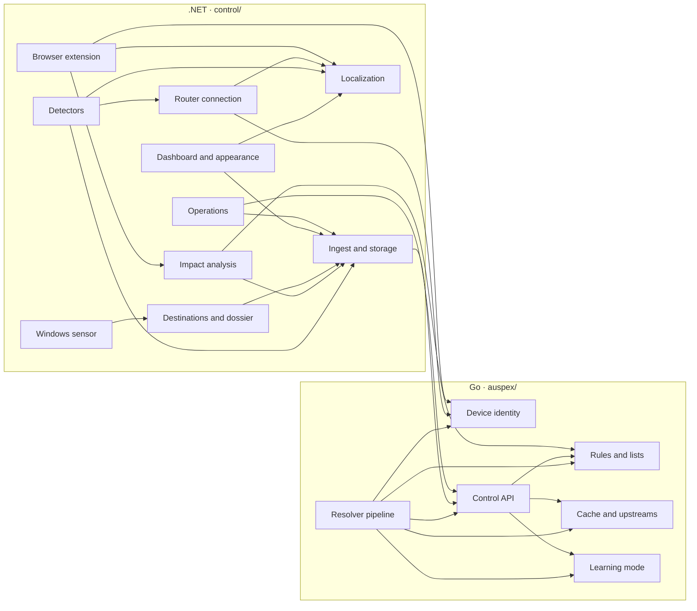

# Codebase blueprint

**Repository:** Auspex
**Generated:** 2026-08-25
**Scope:** the whole repository

## Overview

Auspex is a filtering DNS resolver for a home network, in three parts that
ship together under one version number. The **resolver** (Go, `auspex/`)
answers DNS and does nothing slow while it does. The **control plane**
(.NET 10 / Blazor, `control/`) does everything that is allowed to take time: the interface,
history, detection, the router, the extension and sensor APIs. The **sensor**
(C#, `sensor/`) is optional and runs on a Windows machine to report which
program holds which connection. A **browser extension** (`extension/`) turns
"this page is broken" into one click.

The line between resolver and control plane is deliberate and one-directional:
the control plane fetches, the resolver never pushes. If the control plane is
down, DNS keeps working.

## Features

| Feature | In one sentence | Blueprint |
|---------|-----------------|-----------|
| Resolver pipeline | The order in which a query is decided, and why that order | [resolver-pipeline.md](./resolver-pipeline.md) |
| Rules and lists | Four rule formats, one decision, with its origin attached | [rules-and-lists.md](./rules-and-lists.md) |
| Cache and upstreams | Everything between "we must ask" and "here is the answer" | [cache-and-upstreams.md](./cache-and-upstreams.md) |
| Learning mode | Deny-by-default for devices you do not trust | [learning-mode.md](./learning-mode.md) |
| Device identity | Turning an address into a device that stays the same device | [device-identity.md](./device-identity.md) |
| Control API | The resolver's HTTP interface inwards | [control-api.md](./control-api.md) |
| Ingest and storage | From a ring buffer of minutes to a history of months | [ingest-and-storage.md](./ingest-and-storage.md) |
| Detectors | Nine heuristics that speak up on their own | [detectors.md](./detectors.md) |
| Impact analysis | What a rule would change, before it changes it | [impact-analysis.md](./impact-analysis.md) |
| Router connection | The router as part of the tool, not a neighbour | [router-connection.md](./router-connection.md) |
| Destinations and dossier | Who is behind the address, and what never left the house | [destinations-and-dossier.md](./destinations-and-dossier.md) |
| Browser extension | Exceptions for the device you are sitting at | [browser-extension.md](./browser-extension.md) |
| Windows sensor | Which program is talking — the thing DNS cannot know | [windows-sensor.md](./windows-sensor.md) |
| Dashboard and appearance | The surface, and the parts of it that survive a dropped circuit | [dashboard-ui.md](./dashboard-ui.md) |
| Localization | Two languages, enforced by the compiler | [localization.md](./localization.md) |
| Operations | Sign-in, backup, prerequisites, the seams | [operations.md](./operations.md) |

## Dependency graph

Arrows mean "uses". Only where code actually crosses.

## Core external dependencies

- `github.com/miekg/dns` — the resolver, the cache and both DoH/DoT sides.
- `golang.org/x/net/publicsuffix` — the registrable domain: grouping, learning
  granularity, wildcard edge cases.
- `Microsoft.EntityFrameworkCore.Sqlite` — everything the control plane stores.
- `Microsoft.AspNetCore.DataProtection` — the router account at rest.
- Blazor Server — the interface. No component library, no CSS framework.

## How this documentation is maintained

These blueprints come from the `codebase-mapper` skill. On a code change, call
it again ("update the blueprint"); it recognises this `INDEX.md` and offers an
incremental re-run. Manual additions in a feature file survive an incremental
run as long as the skill does not classify the file as stale.

They are written in English rather than the skill's default, because since 0.9.0 the
whole codebase and all its documentation are.

## Related documentation

- [`../codemap.md`](../codemap.md) — the same territory at a higher altitude,
  including where German deliberately stays in the code
- [`../product.md`](../product.md) — what the tool does, measured
- [`../open-points.md`](../open-points.md) — what is pending, and what is not
- [`../../README.md`](../../README.md) — the front door
