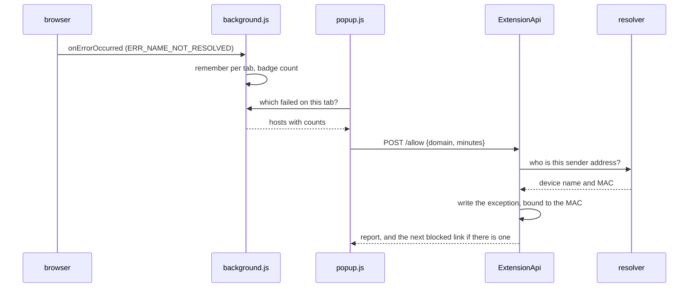

# Browser extension

## Purpose

The browser knows what broke on *this* page. The dashboard sees the same
failure somewhere between the queries of thirty other devices. The extension
turns "something is broken" into a button: it lists the requests that failed
name resolution on the open tab and releases them on a click — time-limited,
for this one device.

## Files

| Path | Role |
|------|------|
| `extension/shared/background.js` | Records failed requests per tab and puts the count on the icon |
| `extension/shared/popup.js` / `.html` / `.css` | The window: what failed here, what is running, what was recently blocked |
| `extension/shared/settings.js` / `.html` | Address and token, checked on save |
| `extension/shared/auspex.js` | The one way in to the API |
| `extension/shared/appearance.js` | Takes theme, accent and language from the dashboard |
| `extension/shared/texts.js` | Display text, German and English |
| `extension/shared/badge.js` | Sets a marker on the dashboard page so it knows the extension is here |
| `extension/chrome/manifest.json` | MV3 service_worker |
| `extension/firefox/manifest.json` | background.scripts |
| `extension/build.sh` | Assembles both from the shared core |
| `control/…/Services/Extension/ExtensionApi.cs` | The endpoints, and the token check in front of them |
| `control/…/Services/Extension/ExceptionService.cs` | Writes the exception into the device profile, bound to the MAC |
| `control/…/Services/Extension/ExceptionCleanupService.cs` | Clears expired ones away |
| `control/…/Services/Extension/ExtensionTokenStore.cs` | Issues, checks and withdraws the token |
| `control/…/Services/Extension/ExtensionPackage.cs` | Packs the archive from the sources on request |

## Dependencies

### Internal

- **[Device identity](./device-identity.md)** — `/api/v1/who` decides which
  device the sender address belongs to.
- **[Impact analysis](./impact-analysis.md)** — the same rule writer.
- **[Localization](./localization.md)** — the server's messages come back in
  the language the window is showing.

### External

The browser APIs: `webRequest`, `webNavigation`, `scripting`, `storage`,
`tabs`, `action`. Nothing else — no framework, no build step beyond `cp`.

## Public interface

Endpoints under `/api/ext`, all behind the bearer token:

| Endpoint | Purpose |
|---|---|
| `GET /me` | Who am I, which profile, which exceptions are running |
| `GET /blocked?minutes=N` | What was recently blocked for this device |
| `POST /allow` | `{domain, minutes}` — minutes null means for good |
| `POST /revoke` | `{domain}` |
| `GET /appearance` | Theme, accent and language, so the window matches |

## Data flow

1. **The extension never says which device it means.** That follows from the
   address the request comes from. A stolen token therefore cannot change
   somebody else's device.
2. **The exception is bound to the MAC**, not the address. Under IPv6 an
   address binding would be worthless from tomorrow, and silently so: nothing
   would break, the exception would merely stop applying.
3. **A redirect usually needs more than one click.** If a link in the CNAME
   chain is on a list, the cloaking check bites — which is what it was built
   for. So the answer names the next blocked link and the popup offers a
   button. Deliberate: whoever opens a cloaking chain should see how long it
   is.
4. **The token is its own means of signing in**, not the dashboard's session:
   the session cookie is `SameSite=Lax` and would not travel from an
   extension at all, and a token of its own can be withdrawn without throwing
   anybody out of the dashboard.
5. `badge.js` runs **only on the configured address**, registered at run time
   rather than declared in the manifest. A content script on every page would
   make the extension detectable by any website — the wrong direction for a
   tool meant to prevent tracking.

## Open questions

- The wire names on both sides are spelled out (`JsonPropertyName` on the
  sensor side, plain property names here) rather than left to a naming policy.
  They drifted apart once already; see
  [`open-points.md`](../open-points.md#14-english-names-in-the-code--done-in-090).
