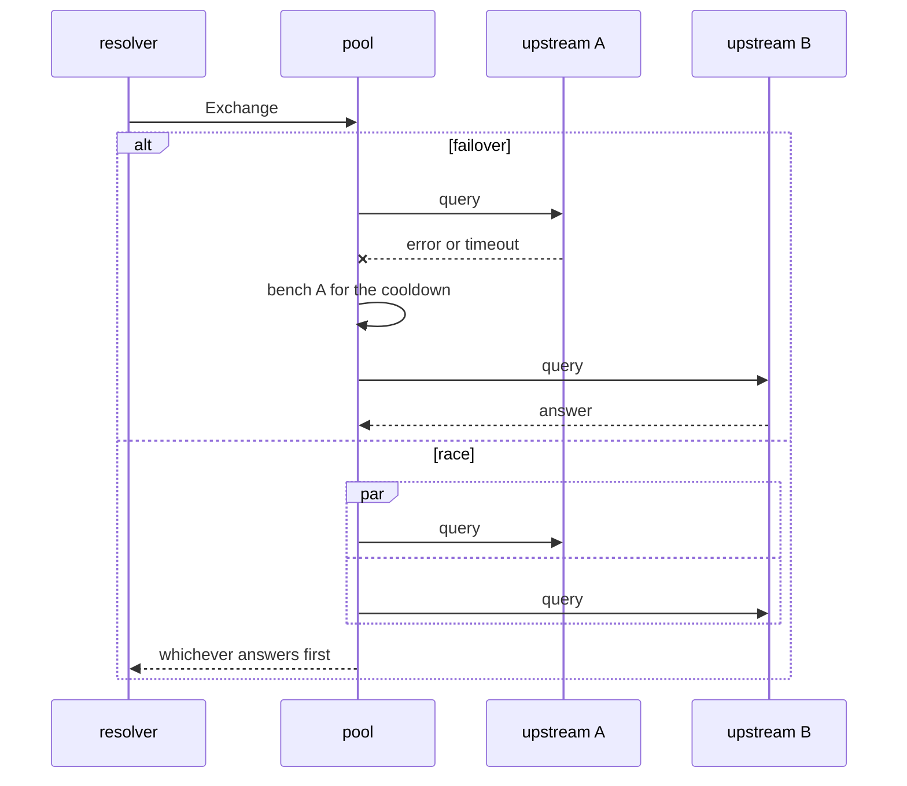

# Cache and upstreams

## Purpose

Everything between "we have to ask somebody" and "here is the answer". The
cache decides how often that has to happen at all; the upstream pool decides
who gets asked and what happens when they stop answering. Both are the reason
a filtered network is not a slower network.

## Files

| Path | Role |
|------|------|
| `auspex/internal/cache/cache.go` | TTL handling, negative caching, LRU eviction, prefetch, serve-stale |
| `auspex/internal/upstream/upstream.go` | One upstream: plain, DoT or DoH, with its own client |
| `auspex/internal/upstream/pool.go` | Choosing between them — failover or race — plus the bench for repeated failures |
| `auspex/internal/doh/doh.go` | DNS over HTTPS per RFC 8484, both as a client and as a server |

## Dependencies

### Internal

- **[Resolver pipeline](./resolver-pipeline.md)** — the only caller.
- **[Control API](./control-api.md)** — purge, forget, warm, and the health
  each upstream reports.

### External

- `github.com/miekg/dns` — the wire format and the DoT client.

## Public interface

```go
func (c *Cache) Get(q Question) (*dns.Msg, bool)
func (c *Cache) Put(q Question, m *dns.Msg)
func (c *Cache) Forget(name string) int      // returns how many entries went
func (c *Cache) Purge()
func (c *Cache) Warm(ctx context.Context, names []string) (int, error)

func (p *Pool) Exchange(ctx context.Context, m *dns.Msg) (*dns.Msg, error)
func (p *Pool) Health() []UpstreamHealth
```

## Data flow

Five decisions in the cache that are easy to get wrong and expensive to get
wrong:

1. **TTL is the remaining time, not the original value.** An entry stored with
   300 and read after 60 seconds answers with 240. Handing out the original
   would make every downstream cache hold it too long.
2. **Negative caching goes through the SOA minimum** (RFC 2308), not through a
   number of our own. Which is why `response.go` puts an SOA in the authority
   section of a block — without it clients do not cache negatively and ask
   again immediately.
3. **SERVFAIL is not cached.** A transient upstream fault must not become a
   lasting one.
4. **The DO bit is part of the key.** Otherwise an answer without signatures
   could be served to a client that asked for them.
5. **`serve_stale` only when all upstreams are dead.** An expired answer is
   better than none — but only then.

The pool:



`race` was measured and rejected for this installation: Quad9 wins 295 of 300
races, so the second contributes nothing, doubles the query load and lets both
providers see every query. For a tool whose reason is privacy that is a bad
trade — the numbers are in [`product.md`](../product.md#measured).

The bootstrap resolver is not a detail: DoH and DoT targets are hostnames, and
resolving them through the system resolver would, after setup, mean asking
Auspex for the address of Auspex's own upstream.

## Open questions

- Under allocation pressure the Go heap grows from 375 to 570 MB. `GOMEMLIMIT`
  would cap it; not set by default because a hard cap trades memory for GC
  pressure and nobody has needed it yet.
