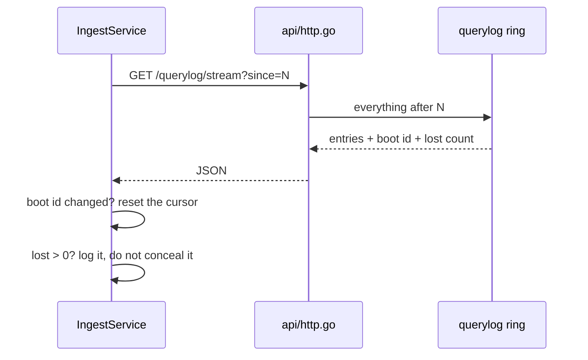

# Control API

## Purpose

The resolver's HTTP interface inwards. It is how the control plane learns what
happened, and the only way anything changes the resolver at run time without a
restart. Deliberately a fetch interface rather than a push one: if the control
plane is down, the resolver keeps resolving and nothing queues up.

## Files

| Path | Role |
|------|------|
| `auspex/internal/api/http.go` | Every endpoint, bearer auth, the JSON shapes |
| `auspex/internal/api/metrics.go` | Prometheus text format, one HELP line per counter |
| `auspex/internal/querylog/querylog.go` | The ring buffer with a monotonic sequence and an overflow counter |

## Dependencies

### Internal

- **[Resolver pipeline](./resolver-pipeline.md)** — everything the API reads
  and reloads.
- **[Learning mode](./learning-mode.md)** — the learn endpoints.
- **[Rules and lists](./rules-and-lists.md)** — the managed list endpoints.
- **[Ingest and storage](./ingest-and-storage.md)** — the one consumer of
  `/querylog/stream`.

### External

None beyond the standard library.

## Endpoints

| Endpoint | Purpose |
|---|---|
| `GET /api/v1/status` | Counters, cache, rule statistics, upstream health |
| `GET /api/v1/querylog?limit=N` | The last queries including the triggering rule |
| `GET /api/v1/querylog/stream?since=N` | Cursor fetch for the ingest, oldest first |
| `GET /api/v1/explain?domain=…&client=…` | The filter decision without a real query |
| `GET /api/v1/who?ip=…` | Which device is behind an address |
| `GET /api/v1/upstreams` | Upstream health only |
| `GET /api/v1/services` | The service catalogue |
| `GET/POST/DELETE /api/v1/clients` | Device profiles |
| `GET/POST/DELETE /api/v1/lists` | Managed lists |
| `POST /api/v1/reload?force=true` | Re-read the lists |
| `POST /api/v1/cache/purge` | Empty the cache |
| `POST /api/v1/cache/forget?name=…` | Drop one name |
| `POST /api/v1/cache/warm` | Warm from a list of names |
| `GET /api/v1/learn[/{profile}[/allowlist]]` | The learned state |
| `POST /api/v1/learn/{profile}/{import,reset,forget}` | Change it |
| `GET /metrics` | Prometheus |
| `GET /healthz` | Health check, always without a token |

`SIGHUP` reloads the rule set as well.

## Data flow

The cursor fetch is the part with the failure modes:

1. **Every instance has a boot id.** After a restart the sequence begins at 1
   again; an old cursor would be too high and would skip everything. When the
   boot id changes, the consumer resets.
2. **Overflow is reported, not concealed.** If the ring buffer wraps before
   the ingest gets there, the answer carries `lost` with the number. A gap
   that nobody mentions reads later like "nothing happened".
3. **`/healthz` never needs the token.** A health check that can fail on
   authentication is a health check that lies.
4. Everything else demands the bearer token once the API listens on more than
   loopback, compared in constant time.

## Open questions

- Push instead of polling would remove the overflow case entirely and shorten
  the delay until detection. See point 4 in
  [`open-points.md`](../open-points.md). Meaningless for home traffic.
