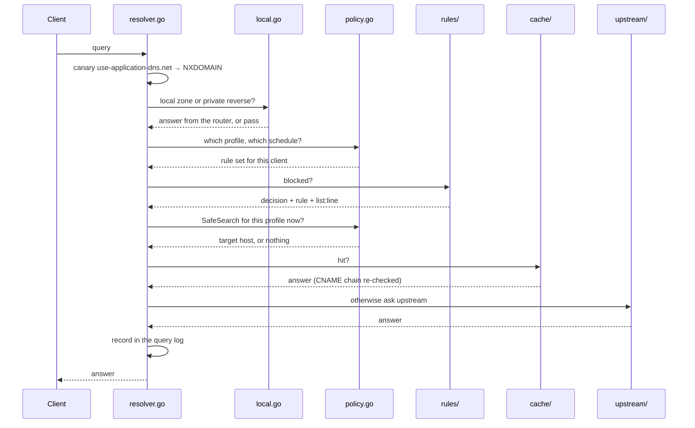

# Resolver pipeline

## Purpose

Answers every DNS query the network asks, and decides in the process whether
it may be answered at all. This is the only part of Auspex that sits in the
hot path — everything else in the project observes it. Without it there is no
product; if it is slow, the whole house is slow.

## Files

| Path | Role |
|------|------|
| `auspex/internal/resolver/resolver.go` | The pipeline itself. Owns the order of the steps and the swap-in of a new rule set |
| `auspex/internal/resolver/policy.go` | Maps a query to a client profile, evaluates schedules and blocked services |
| `auspex/internal/resolver/local.go` | Local zones and private reverse ranges — kept in the house, before the filter |
| `auspex/internal/resolver/response.go` | Builds answers, including the SOA in the authority section for negative caching |
| `auspex/internal/resolver/safesearch.go` | Resolves a SafeSearch redirect into a complete answer — CNAME plus the target's records |
| `auspex/cmd/auspex/main.go` | Wiring, listeners, signals, `-explain` and `-learn-export` |
| `auspex/cmd/auspex/listeners.go` | Optional listeners: an address that may be late, retried until it appears |

## Dependencies

### Internal

- **[Rules and lists](./rules-and-lists.md)** — the decision "blocked or not",
  including which rule and which line said so.
- **[Cache](./cache-and-upstreams.md)** — hits, negative caching, prefetch;
  and the upstreams for everything that has to leave the house.
- **[Learning mode](./learning-mode.md)** — for profiles on `learn` or
  `enforce`.
- **[Device identity](./device-identity.md)** — the client name that travels
  into the query log and the findings.
- **[Control API](./control-api.md)** — the query log the control plane
  collects.
- `internal/services` — the service catalogue and the SafeSearch catalogue.
  Both are plain tables: a key, a display name, and what it matches.

### External

- `github.com/miekg/dns` — message parsing, the server, DoT.
- `golang.org/x/net/publicsuffix` — the registrable domain, needed both for
  grouping and for the learning mode's `domain` granularity.

## Public interface

```go
func New(cfg *config.Config) (*Resolver, error)
func (r *Resolver) ServeDNS(w dns.ResponseWriter, req *dns.Msg)
func (r *Resolver) Explain(name, client string) Explanation
func (r *Resolver) Reload(force bool) error
func (r *Resolver) SelfCheck(ctx context.Context) error
```

`Explanation` carries name, blocked, rule, rule kind, list, line and reason —
the same fields the query log and `/api/v1/explain` show.

## Data flow

The order is the substance. Each step is there because the one before it would
otherwise be wrong.



1. **Special cases first.** `use-application-dns.net` is answered NXDOMAIN
   unconditionally, regardless of the configured block mode — a blocked
   `0.0.0.0` is read by Firefox as "no filter" and it keeps bypassing.
2. **Local zones before the filter and before the cache.** An internal name
   must never end up at a public server, and a cache hit must not be able to
   short-circuit that.
3. **Profile before rules**, because the rule set depends on the profile.
4. **CNAME check on the hit path as well.** Without it a cloaking chain could
   be stored once and then used freely.
5. **SafeSearch after the filter and before the cache.** After, because
   whoever blocked YouTube outright meant blocked and not "moderately
   filtered". Before, because the answer depends on who is asking — the
   children's tablet and the workshop computer must not be served each
   other's. The target's own resolution *is* cached, under its own key, so
   several devices redirected to the same provider share one query upstream.

## Open questions

- Under sustained load (41,000 queries/s in the test) the query-log ring
  buffer overflows. It is reported, not concealed — see point 4 in
  [`open-points.md`](../open-points.md).
