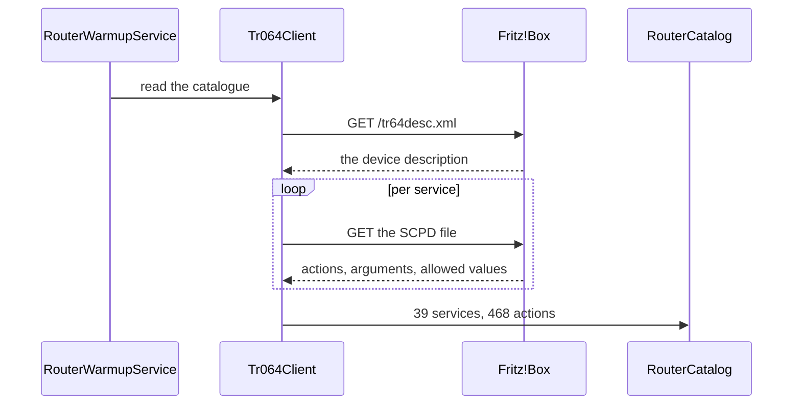

# Router connection

## Purpose

Makes the router part of the tool rather than a neighbour. A DNS block is
bypassed by any device that hard-codes an address; at the router that same
device can actually have its internet cut off. That is enforcement on a second
layer, and neither Pi-hole nor AdGuard Home has it.

## Files

| Path | Role |
|------|------|
| `control/Auspex.Control/Services/Router/Tr064Client.cs` | SOAP over port 49000/49443, digest sign-in, SCPD discovery |
| `control/Auspex.Control/Services/Router/RouterCatalog.cs` | What the discovery produced: services, actions, arguments, limits |
| `control/Auspex.Control/Services/Router/RouterSearch.cs` | Finds an action by how people ask for it in German |
| `control/Auspex.Control/Services/Router/RouterAdmin.cs` | The short street: the handful of operations needed daily |
| `control/Auspex.Control/Services/Router/FritzWebClient.cs` | The unclean route — signs in like a browser for what TR-064 does not offer |
| `control/Auspex.Control/Services/Router/RouterLog.cs` | Splits the box's event log and classifies the entries |
| `control/Auspex.Control/Services/Router/RouterWatchService.cs` | Watches port mappings and devices, produces findings |
| `control/Auspex.Control/Services/Router/RouterWarmupService.cs` | Pre-reads the catalogue at startup |
| `control/Auspex.Control/Services/Router/DeviceNameExportService.cs` | Writes the device list out for the resolver |
| `control/Auspex.Control/Services/Router/RouterSettingsStore.cs` | Credentials, encrypted with Data Protection |
| `control/Auspex.Control/Services/Router/RouterOptions.cs` | Host, account, read-only, paths |

## Dependencies

### Internal

- **[Device identity](./device-identity.md)** — the exported device list.
- **[Detectors](./detectors.md)** — `portfreigabe` and `neues-geraet` come
  from the watch service.
- **[Localization](./localization.md)** — every display sentence, including
  the two confirmation routes a Fritz!Box offers.

### External

- `System.Security.Cryptography` — the two-stage PBKDF2-SHA256 the web
  interface demands.
- `Microsoft.AspNetCore.DataProtection` — encrypting the stored account.

## Public interface

```csharp
Task<RouterList<RouterService>> Tr064Client.CatalogAsync(CancellationToken ct);
Task<RouterResult> RouterAdmin.CallAsync(string service, string action, IDictionary<string,string> args, CancellationToken ct);
Task<Ipv4Settings?> FritzWebClient.ReadIpv4Async(CancellationToken ct);
Task<RouterResult> FritzWebClient.SetLocalDnsAsync(string address, CancellationToken ct);
Task<IReadOnlyList<RouterChange>> RouterWatchService.CompareAsync(CancellationToken ct);
```

`RouterList<T>` is not a list: it carries the reason as well. That exists
because the calls used to return an empty list on a rejected sign-in,
indistinguishable from "there is nothing", and the port mappings page then
reported "no door leads in from outside". A false statement about the security
of the network.

## Data flow



1. **Discovered, not hand-written.** Maintaining 468 calls by hand would be
   out of date the day it was finished. A new firmware brings new actions
   along by itself, and the input fields in the catalogue come from the
   allowed values and limits in the description.
2. **Read actions fall back to the open route.** A Fritz!Box hands out the
   device list without a sign-in, so a wrongly stored account still shows the
   list rather than an empty page.
3. **Two channels, because one does not suffice.** The local DNS server the
   box distributes over DHCP is not in TR-064. For that `FritzWebClient` signs
   in like a browser and posts the complete form back, to the
   address the page itself names, not a hard-wired one. The first version
   posted to `data.lua`, where the box accepts the call and silently discards
   it; it only came to light because the value is read back afterwards.
4. **An unticked checkbox is not sent by a form.** Sending it anyway would
   switch on things that were off, such as a LAN bridge that rebuilds the network,
   say. This is the most dangerous single case in the whole project and has a
   test of its own.
5. **Changes that can cut off access** — Wi-Fi off, DHCP off, changing the LAN
   IP, demand an extra confirmation, and `ROUTER_READONLY=true` blocks
   everything changing.

## Open questions

- Checked against exactly one model, a Fritz!Box 5690 Pro. The discovery
  should cope with others; reports from other devices, failed ones included,
  are the most valuable contribution.
- Traffic per device is kept by the box but the clean route to it has not been
  checked. See point 10 in [`open-points.md`](../open-points.md).
